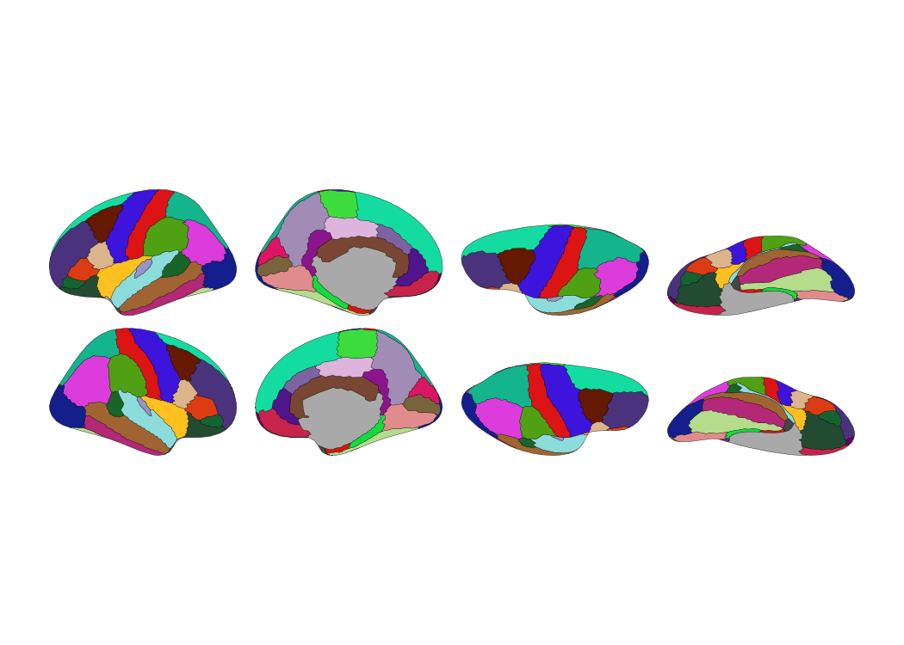
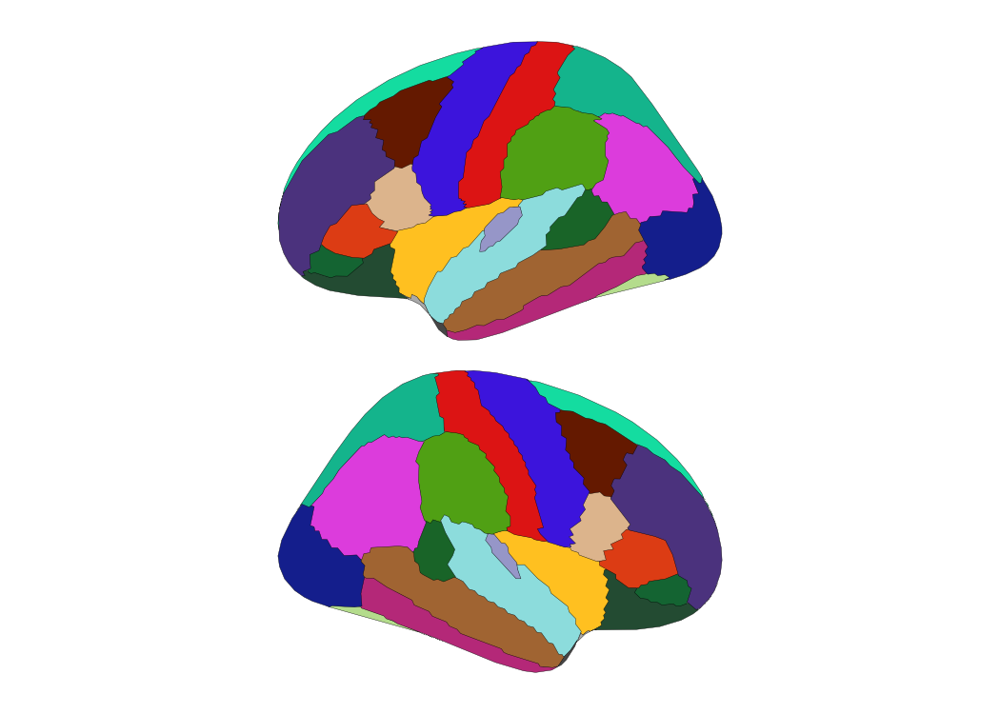

# ggsegpy

Brain atlas visualization in Python — port of the R
[ggseg](https://ggseg.github.io/ggseg/) ecosystem.

[](https://lifecycle.r-lib.org/articles/stages.html#experimental)
[](https://pypi.org/project/ggsegpy/)
[](https://github.com/ggsegverse/ggsegpy/actions/workflows/test.yml)
[](https://ggsegverse.github.io/ggsegpy/)

## Installation

``` bash
pip install git+https://github.com/ggsegverse/ggsegpy.git
```

## 2D Visualization

``` python
from plotnine import ggplot, aes
from ggsegpy import geom_brain, dk

ggplot() + geom_brain(atlas=dk())
```



**With custom data:**

``` python
import pandas as pd

data = pd.DataFrame({
    "region": ["precentral", "postcentral", "superior frontal", "inferior parietal"],
    "value": [0.9, 0.7, 0.5, 0.3]
})

ggplot(data) + geom_brain(atlas=dk(), mapping=aes(fill="value"))
```


### Subcortical atlas

``` python
from ggsegpy import aseg

ggplot() + geom_brain(atlas=aseg())
```


## 3D Visualization

``` python
from ggsegpy import ggseg3d, pan_camera, add_glassbrain

# Basic 3D plot
fig = ggseg3d(atlas=dk())
fig = pan_camera(fig, "left lateral")
fig
```

``` python
# With glass brain overlay
fig = ggseg3d(atlas=aseg())
fig = add_glassbrain(fig, opacity=0.1)
fig = pan_camera(fig, "left lateral")
fig
```

## Atlas Manipulation

Filter, rename, and reorganize atlas regions:

``` python
from ggsegpy import atlas_region_keep, atlas_view_keep

# Keep only frontal regions, lateral view
frontal = atlas_region_keep(dk(), "frontal")
frontal = atlas_view_keep(frontal, "lateral")

ggplot() + geom_brain(atlas=frontal)
```



``` python
from ggsegpy import atlas_region_rename, atlas_regions

# Shorten region names
renamed = atlas_region_rename(dk(), "superior", "sup.")
print([r for r in atlas_regions(renamed) if "sup." in r][:3])
```

    ['banks of sup. temporal sulcus', 'sup. frontal', 'sup. parietal']

## Available Atlases

| Atlas       | Type         | Description                         |
|-------------|--------------|-------------------------------------|
| `dk()`      | Cortical     | Desikan-Killiany parcellation       |
| `aseg()`    | Subcortical  | FreeSurfer subcortical segmentation |
| `tracula()` | White matter | TRACULA tract atlas                 |

## Features

- 2D visualization using [plotnine](https://plotnine.org/) (ggplot2
  syntax)
- 3D interactive visualization using
  [Plotly](https://plotly.com/python/)
- Atlas manipulation: filter, rename, reorder regions and views
- Easy data merging with `brain_join()`
- Customizable themes: `theme_brain()`, `theme_darkbrain()`,
  `theme_custombrain()`
- Glass brain overlays for 3D subcortical context

## Documentation

Full documentation at
[ggsegverse.github.io/ggsegpy](https://ggsegverse.github.io/ggsegpy/)

## License

MIT
